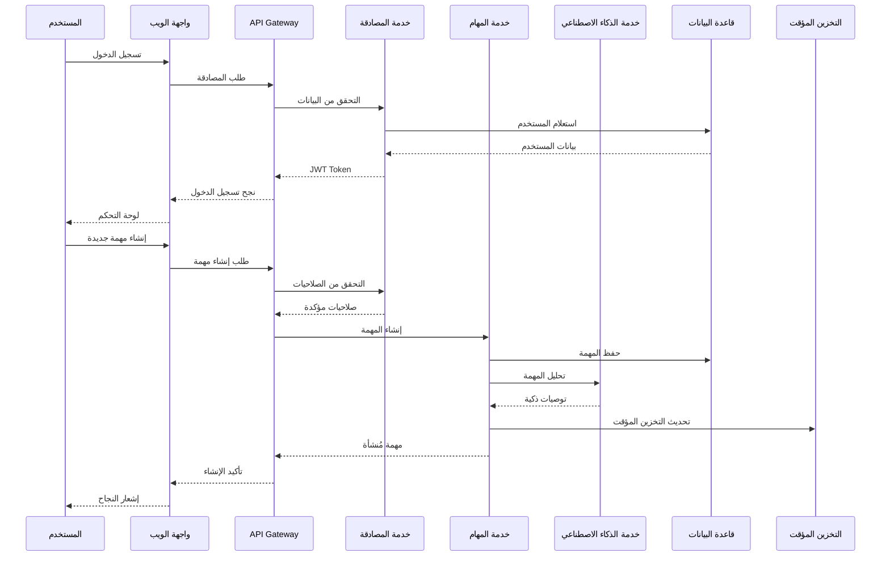
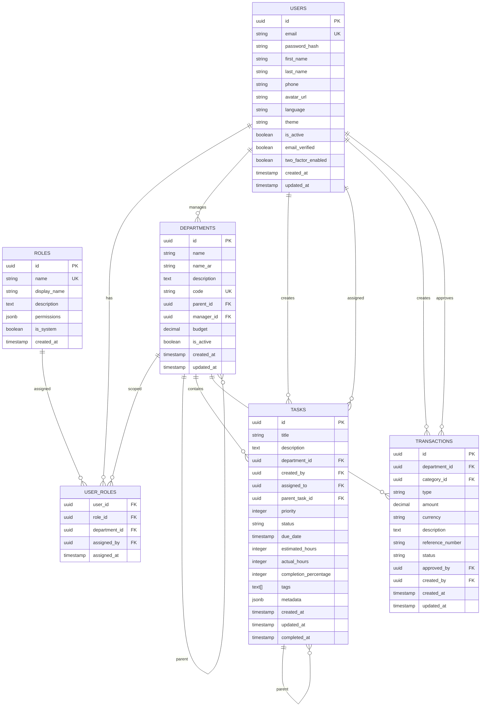
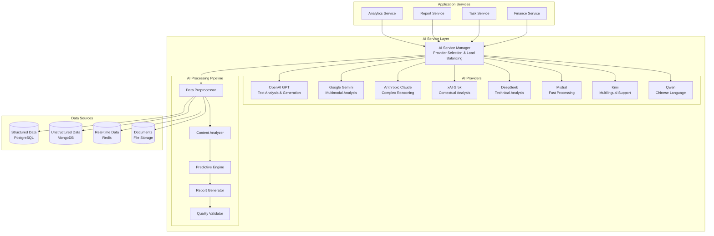
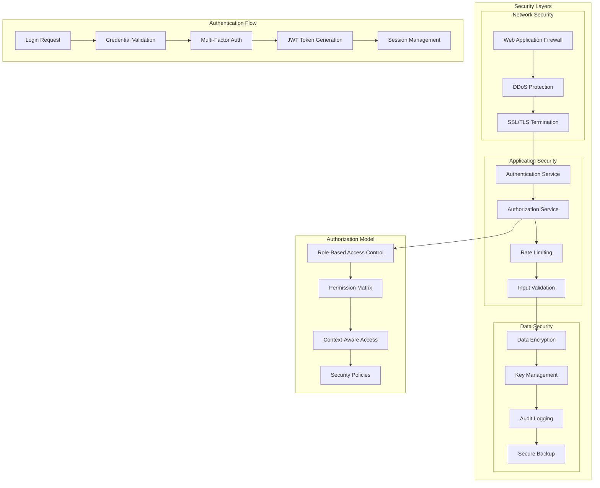
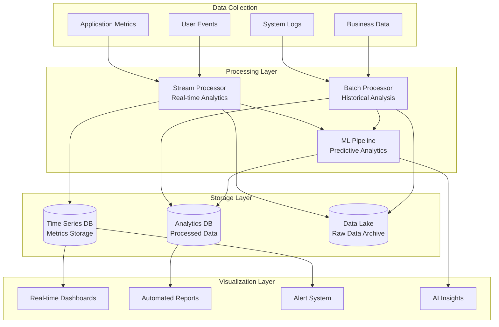
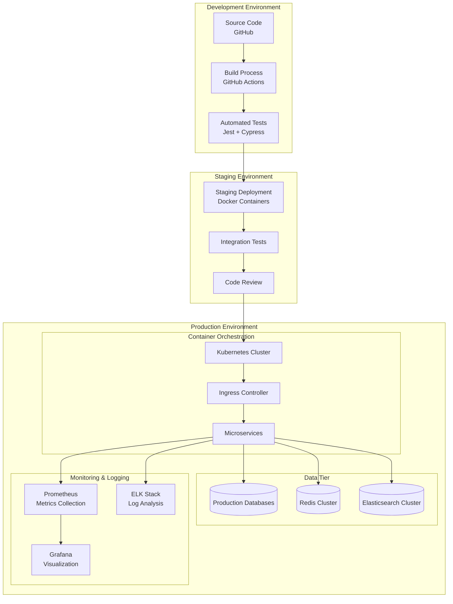
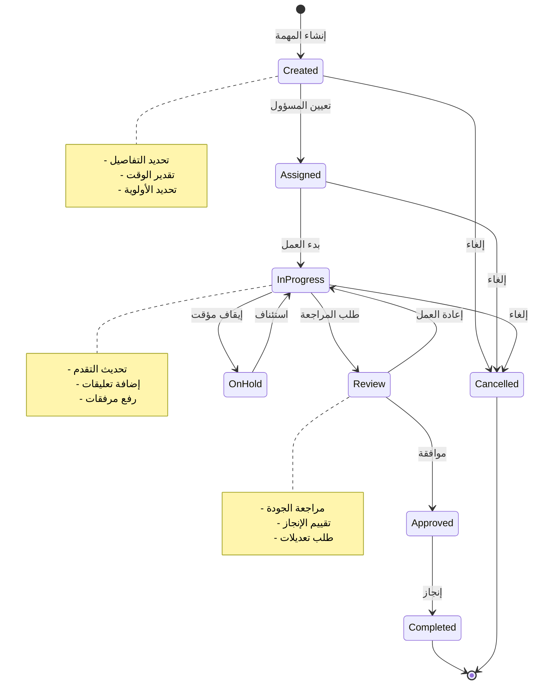

# YYO Agent AI - مخططات النظام

## 🏗️ المعمارية العامة

```mermaid
graph TB
    subgraph "Client Layer"
        WEB[Web App<br/>React + TypeScript]
        MOBILE[Mobile App<br/>React Native]
        API_CLIENT[API Clients<br/>Third Party]
    end

    subgraph "API Gateway Layer"
        GATEWAY[API Gateway<br/>Express.js + TypeScript]
        AUTH[Authentication<br/>JWT + 2FA]
        RATE_LIMIT[Rate Limiting<br/>Redis]
    end

    subgraph "Application Layer"
        subgraph "Core Services"
            USER_SVC[User Service]
            DEPT_SVC[Department Service]
            TASK_SVC[Task Service]
            WORKFLOW_SVC[Workflow Engine]
        end
        
        subgraph "Business Services"
            FINANCE_SVC[Finance Service]
            HR_SVC[HR Service]
            ANALYTICS_SVC[Analytics Service]
            REPORT_SVC[Report Service]
        end
        
        subgraph "AI Services"
            AI_MANAGER[AI Service Manager]
            OPENAI[OpenAI Provider]
            GEMINI[Gemini Provider]
            CLAUDE[Claude Provider]
            GROK[Grok Provider]
        end
    end

    subgraph "Data Layer"
        POSTGRES[(PostgreSQL<br/>Primary Database)]
        MONGODB[(MongoDB<br/>Analytics & Documents)]
        REDIS[(Redis<br/>Cache & Sessions)]
        ELASTICSEARCH[(Elasticsearch<br/>Search & Logs)]
    end

    subgraph "External Services"
        EMAIL[Email Service<br/>SMTP]
        SMS[SMS Service]
        STORAGE[File Storage<br/>AWS S3]
        MONITORING[Monitoring<br/>Prometheus + Grafana]
    end

    WEB --> GATEWAY
    MOBILE --> GATEWAY
    API_CLIENT --> GATEWAY
    
    GATEWAY --> AUTH
    GATEWAY --> RATE_LIMIT
    
    GATEWAY --> USER_SVC
    GATEWAY --> DEPT_SVC
    GATEWAY --> TASK_SVC
    GATEWAY --> WORKFLOW_SVC
    GATEWAY --> FINANCE_SVC
    GATEWAY --> HR_SVC
    GATEWAY --> ANALYTICS_SVC
    GATEWAY --> REPORT_SVC
    
    ANALYTICS_SVC --> AI_MANAGER
    REPORT_SVC --> AI_MANAGER
    AI_MANAGER --> OPENAI
    AI_MANAGER --> GEMINI
    AI_MANAGER --> CLAUDE
    AI_MANAGER --> GROK
    
    USER_SVC --> POSTGRES
    DEPT_SVC --> POSTGRES
    TASK_SVC --> POSTGRES
    FINANCE_SVC --> POSTGRES
    HR_SVC --> POSTGRES
    
    ANALYTICS_SVC --> MONGODB
    REPORT_SVC --> MONGODB
    
    AUTH --> REDIS
    RATE_LIMIT --> REDIS
    
    ANALYTICS_SVC --> ELASTICSEARCH
    MONITORING --> ELASTICSEARCH
    
    USER_SVC --> EMAIL
    USER_SVC --> SMS
    REPORT_SVC --> STORAGE
```

## 🔄 تدفق البيانات الرئيسي

## 🗄️ هيكل قاعدة البيانات

## 🤖 معمارية الذكاء الاصطناعي

## 🔒 معمارية الأمان

## 📊 معمارية التحليلات والمراقبة

## 🚀 معمارية النشر

## 🔄 تدفق المهام الذكي

---

## 📝 ملاحظات التصميم

هذا المستند يحتوي على المخططات الأساسية لمعمارية النظام. المخططات قابلة للتحديث مع تطور المشروع وإضافة مكونات جديدة.

**تاريخ الإنشاء:** نوفمبر 2024  
**الإصدار:** 1.0  
**المراجعة التالية:** ديسمبر 2024

